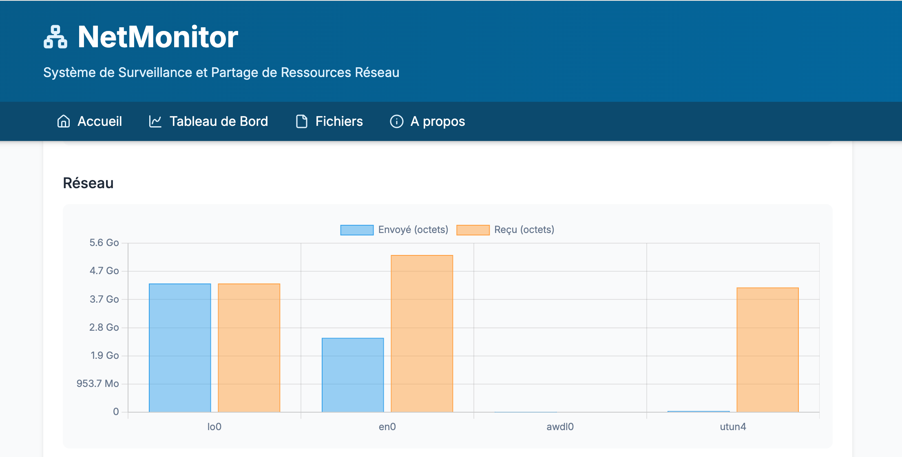

# NetMonitor 📊

<p align="center">
  
</p>

Un système de surveillance et partage de ressources réseau développé en Python avec une architecture client-serveur robuste et une interface web moderne.

## 📋 Table des matières

- [Présentation](#présentation)
- [Architecture](#architecture)
- [Fonctionnalités](#fonctionnalités)
- [Prérequis](#prérequis)
- [Installation](#installation)
- [Utilisation](#utilisation)
- [Structure du projet](#structure-du-projet)
- [API et protocole](#api-et-protocole)
- [Tests](#tests)
- [Captures d'écran](#captures-décran)
- [Contribution](#contribution)
- [Licence](#licence)

## 🎯 Présentation

NetMonitor est un système de surveillance réseau complet qui permet de :
- Surveiller en temps réel les métriques système (CPU, mémoire, disque, réseau)
- Gérer plusieurs clients simultanément depuis une interface centralisée
- Visualiser les données avec des graphiques interactifs
- Partager des fichiers entre les machines surveillées
- Conserver un historique des métriques pour analyse

## 🏗️ Architecture

Le système est composé de trois modules principaux :

### 🖥️ Module Server
- **Serveur TCP** utilisant `select()` pour gérer plusieurs connexions simultanées
- **Gestion des clients** avec identifiants uniques (UUID)
- **Stockage persistant** des métriques au format JSON
- **Protocole de communication** personnalisé avec marqueurs de fin

### 📱 Module Client
- **Collecte de métriques** système avec `psutil`
- **Communication TCP** robuste avec gestion des déconnexions
- **Reconnexion automatique** en cas de panne réseau
- **Configuration flexible** via ligne de commande

### 🌐 Module Web
- **Interface Flask** moderne et responsive
- **Graphiques interactifs** avec Chart.js
- **Gestionnaire de fichiers** intégré
- **Navigation dans l'historique** avec pagination

## ✨ Fonctionnalités

### Surveillance système
- **CPU** : Utilisation globale et par cœur
- **Mémoire** : RAM utilisée/disponible, swap
- **Disque** : Espace libre/utilisé par partition
- **Réseau** : Trafic entrant/sortant par interface
- **Système** : Uptime, processus, informations OS

### Interface web
- **Tableau de bord** temps réel multi-clients
- **Graphiques dynamiques** avec Chart.js
- **Historique complet** des métriques
- **Pagination intelligente** des données
- **Export des données** au format JSON

### Gestion de fichiers
- **Upload de fichiers** avec drag & drop
- **Téléchargement sécurisé** 
- **Suppression de fichiers**
- **Limite de taille** configurable (10 Go par défaut)

## 🔧 Prérequis

- **Python 3.7+**
- **Système d'exploitation** : Linux, macOS, Windows
- **Réseau** : Connexion TCP entre client et serveur

## 📦 Installation

### 1. Cloner le repository
```bash
git clone https://github.com/codewithmpia/netmonitor.git
cd netmonitor
```

### 2. Créer un environnement virtuel
```bash
python -m venv venv
source venv/bin/activate  # Linux/Mac
# ou
venv\Scripts\activate     # Windows
```

### 3. Installer les dépendances
```bash
pip install -r requirements.txt
```

### 4. Vérifier l'installation
```bash
python run.py --help
python run_client.py --help
```

## 🚀 Utilisation

### Démarrage du serveur
```bash
# Serveur + interface web
python run.py

# Serveur seul avec configuration personnalisée
python run.py --host 0.0.0.0 --port 9000 --web-port 5000
```

### Démarrage d'un client
```bash
# Client local
python run_client.py --host localhost --port 9000 --interval 5

# Client distant avec paramètres personnalisés
python run_client.py --host 192.168.1.100 --port 9000 --interval 5
```

### Accès à l'interface web
```
http://localhost:5000

ou
http://192.168.1.100:5000

```

## 📁 Structure du projet

```
netmonitor/
├── 📁 server/              # Module serveur
│   ├── __init__.py
│   ├── server.py           # Serveur TCP principal
│   ├── client.py           # Gestionnaire de clients
│   ├── handlers.py         # Traitement des messages
│   ├── storage.py          # Stockage des métriques
│   └── utils.py            # Utilitaires communs
├── 📁 client/              # Module client
│   ├── __init__.py
│   ├── client.py           # Client principal
│   ├── system_info.py      # Collecte de métriques
│   ├── connection.py       # Gestion réseau
│   └── logging_config.py   # Configuration logs
├── 📁 web/                 # Module web Flask
│   ├── __init__.py
│   ├── settings.py         # Configuration Flask
│   ├── views.py            # Vues et routes
│   ├── utils.py            # Utilitaires web
│   ├── forms.py            # Formulaires WTF
│   ├── filters.py          # Filtres Jinja2
│   └── 📁 assets/          # Templates et static
├── 📁 data/                # Données et fichiers
│   ├── 📁 metrics/         # Métriques stockées
│   └── 📁 files/           # Fichiers partagés
├── run.py                  # Script serveur
├── run_client.py           # Script client
└── requirements.txt        # Dépendances
```

## 🔌 API et protocole

### Protocole de communication
- **Transport** : TCP avec sockets
- **Format** : JSON + marqueur `#END#`
- **Buffer** : 4096 octets avec fragmentation
- **Authentification** : Basée sur UUID client

### Types de messages
```python
# Enregistrement client
{
    "type": "registration",
    "client_id": "uuid",
    "hostname": "machine-name",
    "ip": "192.168.1.100",
    "system_info": {...}
}

# Métriques système
{
    "type": "metrics",
    "client_id": "uuid",
    "timestamp": "2024-07-15T10:30:00",
    "metrics": {...}
}

# Déconnexion
{
    "type": "disconnect",
    "client_id": "uuid"
}
```

## 🧪 Tests

### Test local
```bash
# Terminal 1 : Serveur
python run.py

# Terminal 2 : Client
python run_client.py --host localhost --port 9000
```

### Test réseau
```bash
# Serveur (192.168.1.50)
python run.py --host 0.0.0.0

# Client distant
python run_client.py --host 192.168.1.100 --port 9000
```

### Configuration pare-feu
```bash
# Linux (ufw)
sudo ufw allow 5000/tcp    # Interface web
sudo ufw allow 9000/tcp    # Serveur NetMonitor

# Test connectivité
telnet 192.168.1.100 9000
telnet 192.168.1.100 5000
```

## 📸 Captures d'écran

### Interface principale
L'interface web affiche tous les clients connectés avec leurs métriques en temps réel.

### Métriques détaillées
Visualisation des métriques d'un client spécifique avec graphiques interactifs Chart.js.

### Gestion de fichiers
Interface de partage de fichiers avec upload par drag & drop.

## 🤝 Contribution

Les contributions sont les bienvenues ! Pour contribuer :

1. **Fork** le projet
2. **Créer** une branche feature (`git checkout -b feature/AmazingFeature`)
3. **Commit** les changements (`git commit -m 'Add AmazingFeature'`)
4. **Push** la branche (`git push origin feature/AmazingFeature`)
5. **Ouvrir** une Pull Request

### Guidelines de développement
- Respecter le style de code existant
- Ajouter des tests pour les nouvelles fonctionnalités
- Documenter les modifications dans le README
- Suivre les conventions de nommage Python (PEP 8)

## 🐛 Problèmes connus

- **Limitation buffer** : Messages volumineux fragmentés (géré automatiquement)
- **Sécurité** : Authentification basique (convient pour réseaux privés)
- **Performance** : Optimisé pour ~50 clients simultanés

## 📈 Améliorations futures

- [ ] Authentification JWT
- [ ] Chiffrement TLS/SSL
- [ ] Alertes et notifications
- [ ] API REST complémentaire
- [ ] Support Docker
- [ ] Monitoring de services
- [ ] Export vers bases de données

## 📄 Licence

Ce projet est sous licence MIT. Voir le fichier [LICENSE](LICENSE) pour plus de détails.

## 👨‍💻 Auteur

**Mpia Mimpiya PULUDISU**
- GitHub: [@codewithmpia](https://github.com/codewithmpia)
- Université Paris 8 - L2 Informatique
- Cours : Réseaux (Chapitre 10)

---

⭐ **N'hésitez pas à donner une étoile si ce projet vous a été utile !**
